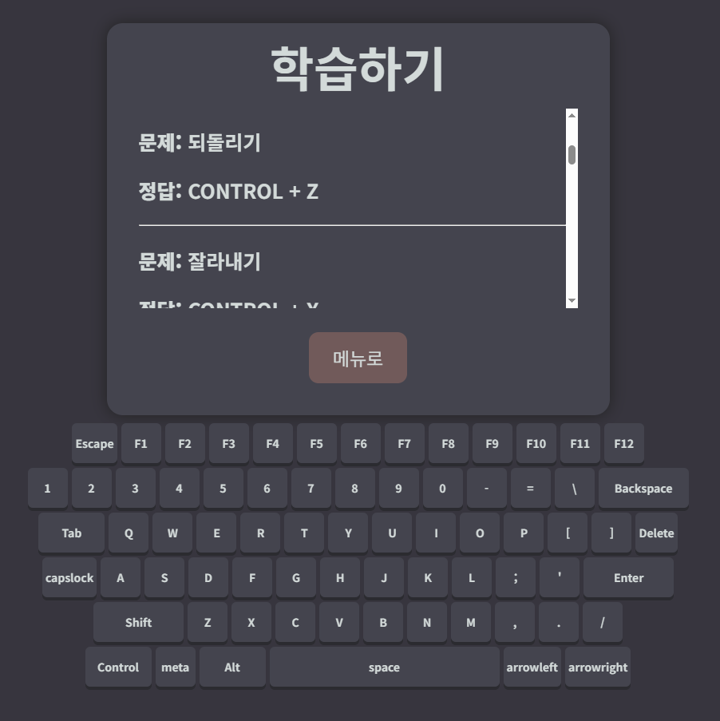
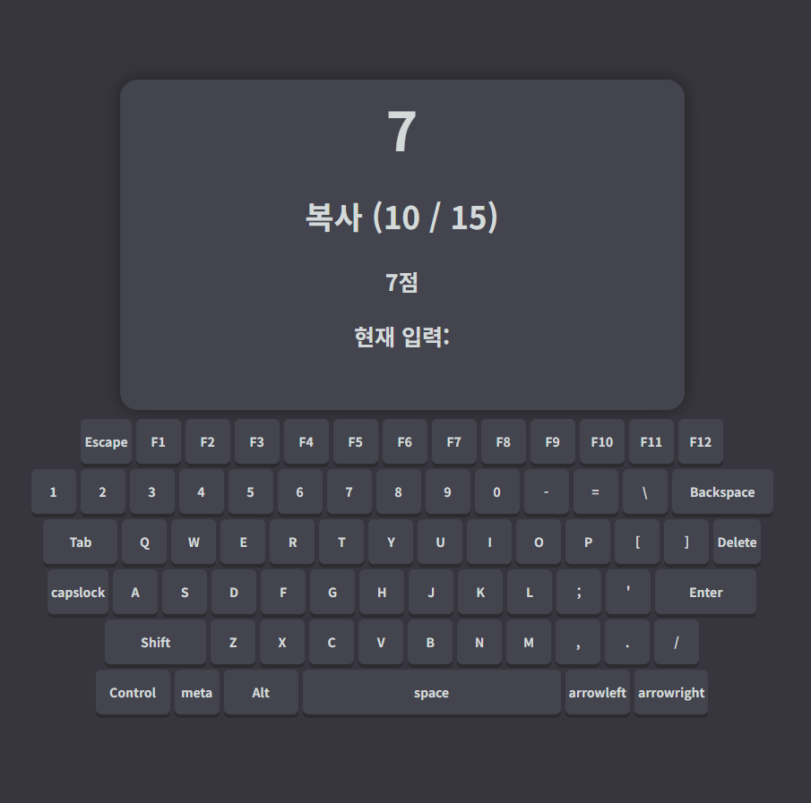
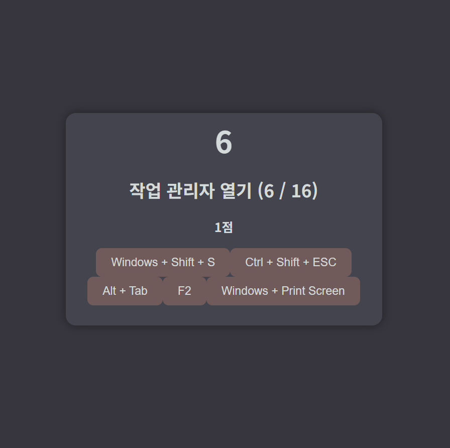
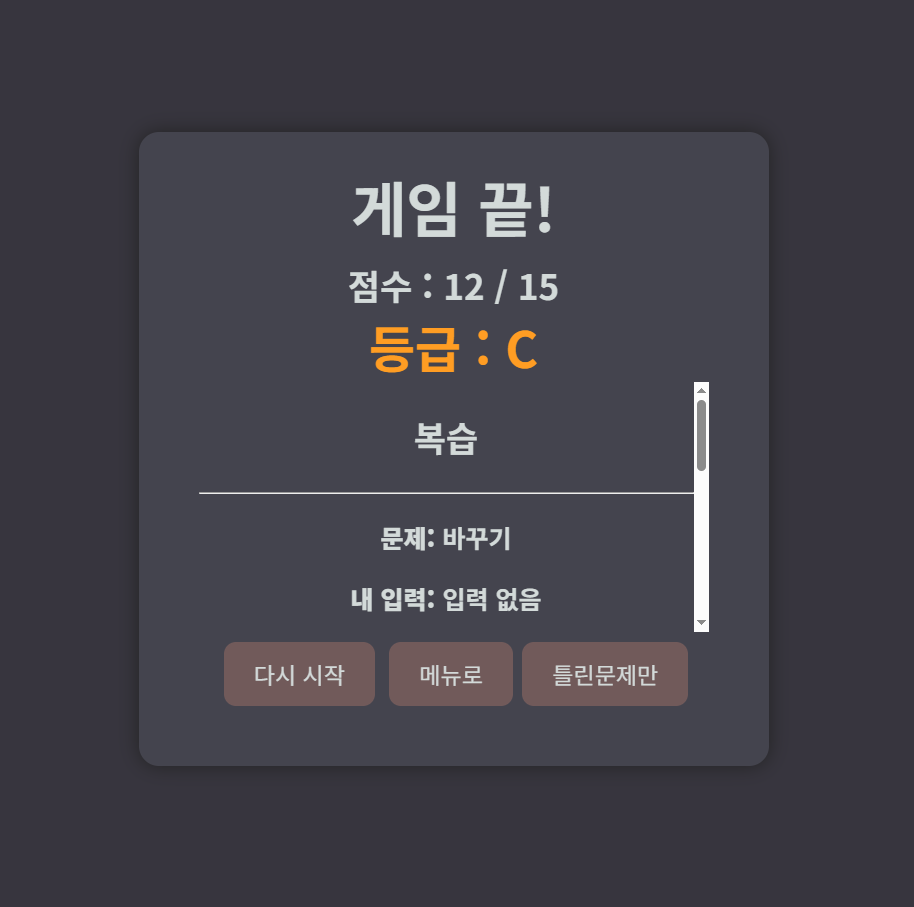

# ShortCut Lab

---

## 프로젝트 소개
컴퓨터 단축키를 쉽게 익힐수 있는 웹 게임입니다
카테고리별 단축키를 익힐수 있으며,
학습 모드, 틀린 문제만 다시 풀 수 있는 기능이 있습니다

---

## 주요 기능

- 키보드를 이용한 단축키 입력
- 다양한 단축키 문제 출제
- 단축키 학습
- 제한 시간 시스템
- 정답/오답 판정
- 점수 시스템
- 게임 재시작/틀린문제만 풀기
- 게임 결과

---

## 기술 스택

- HTML5
- CSS3
- JavaScript

---

## 실행 방법

### Web

[게임 플레이](https://wandokong.github.io/shortCut/)

---

## 게임 화면

### 시작 화면

### 학습 화면

### 게임 화면

### 결과 화면

---

## 개발 포인트
- JavaScript의 'keydown' 이벤트를 사용하여 키 입력을 실시간으로 감지
- 'setInterval()' 을 사용하여 제한시간 구현
- 배열과 객체를 이용하여 카테고리별 문제 데이터 관리
- 틀린 문제를 별도로 저장하여 다시 풀 수 있도록 구현
- 학습 모드와 게임 모드를 구분하여 서로 다른 방식으로 문제 제공

---

## 배운 점
- JavaScript의 키보드 입력 감지 방법을 배웠습니다
- 'setInterval()'를 이용하여 제한 시간을 구현하는 방법을 배웠습니다
- 배열과 객체를 활용하여 게임 데이터를 관리하는 방법을 배웠습니다

---

## 향후 개선
- 최고 점수 저장 기능
- 종합 문제 기능
- 통계 기능
- 사용자 정의 문제
- 일일 도전 기능
---

## 개발

**박준성**

HTML5 · CSS3 · JavaScript